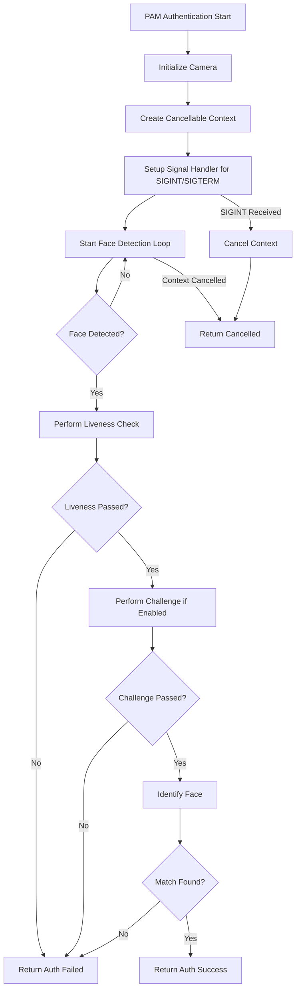

# Authentication Flow Improvements Plan

## Problem Statement

The current authentication flow fails if no face is detected after 5 attempts. The user wants:

1. **Continuous face detection** - Wait until a face is found instead of failing after 5 attempts
2. **No timeout** - Remove the timeout constraint (or make it very long)
3. **Ctrl+C support** - Allow the PAM check to be stopped with Ctrl+C

## Current Flow Analysis

### Current Behavior in [`captureAndDetect()`](internal/auth/engine.go:318)

```go
func (e *Engine) captureAndDetect() (image.Image, models.Detection, error) {
    maxAttempts := 5  // Fixed 5 attempts
    
    for attempt := 0; attempt < maxAttempts; attempt++ {
        // Capture frame and detect face
        // If no face, continue to next attempt
    }
    
    // After 5 attempts with no face:
    return lastImage, models.Detection{}, fmt.Errorf("no face detected after %d attempts", maxAttempts)
}
```

### Current PAM Flow in [`performAuthentication()`](pkg/pam/pam_module.go:174)

```go
func performAuthentication(pamh *C.pam_handle_t, engine *auth.Engine, cfg *config.Config, username string) C.int {
    ctx, cancel := context.WithTimeout(context.Background(),
        time.Duration(cfg.Auth.SessionTimeout)*time.Second)  // Default: 3600 seconds
    defer cancel()

    result, err := engine.AuthenticateUser(ctx, username)
    // ...
}
```

## Proposed Solution

### Architecture Overview



### Changes Required

#### 1. Modify [`captureAndDetect()`](internal/auth/engine.go:318) in `engine.go`

**Current:**
- Fixed 5 attempts
- Returns error if no face after attempts

**New:**
- Continuous loop with context cancellation check
- Returns only when face detected OR context cancelled
- Add informative logging for user feedback

```go
func (e *Engine) captureAndDetect(ctx context.Context) (image.Image, models.Detection, error) {
    if e.inferenceClient == nil {
        return nil, models.Detection{}, fmt.Errorf("inference client not connected")
    }

    attempt := 0
    for {
        select {
        case <-ctx.Done():
            return nil, models.Detection{}, fmt.Errorf("authentication cancelled")
        default:
            // Continue with detection
        }

        attempt++
        
        // Small delay between frame captures
        if attempt > 1 {
            time.Sleep(100 * time.Millisecond)
        }

        // Capture frame
        img, err := e.captureFrameFromCamera(attempt - 1)
        if err != nil {
            continue
        }

        // Detect faces
        detection, err := e.detectSingleFace(img, attempt - 1)
        if err != nil {
            // Log periodically for user feedback
            if attempt%10 == 0 {
                e.logger.Infof("Still waiting for face detection... attempt %d", attempt)
            }
            continue
        }

        e.logger.Infof("Face detected on attempt %d (confidence: %.3f)", attempt, detection.Confidence)
        return img, detection, nil
    }
}
```

#### 2. Add Signal Handling in [`pkg/pam/pam_module.go`](pkg/pam/pam_module.go)

Add a new function to setup signal handling:

```go
import (
    "os"
    "os/signal"
    "syscall"
)

// setupSignalHandler creates a context that cancels on SIGINT/SIGTERM
func setupSignalHandler(parentCtx context.Context) (context.Context, context.CancelFunc) {
    ctx, cancel := context.WithCancel(parentCtx)
    
    sigChan := make(chan os.Signal, 1)
    signal.Notify(sigChan, syscall.SIGINT, syscall.SIGTERM)
    
    go func() {
        select {
        case <-sigChan:
            logger.Info("Received interrupt signal, cancelling authentication")
            cancel()
        case <-ctx.Done():
        }
        signal.Stop(sigChan)
    }()
    
    return ctx, cancel
}
```

#### 3. Update [`performAuthentication()`](pkg/pam/pam_module.go:174)

```go
func performAuthentication(pamh *C.pam_handle_t, engine *auth.Engine, cfg *config.Config, username string) C.int {
    // Create base context - no timeout as per user request
    ctx := context.Background()
    
    // Setup signal handling for Ctrl+C
    ctx, cancel := setupSignalHandler(ctx)
    defer cancel()

    pamInfo(pamh, "LinuxHello: Waiting for face detection... Press Ctrl+C to cancel")
    
    result, err := engine.AuthenticateUser(ctx, username)
    if err != nil {
        if ctx.Err() == context.Canceled {
            logger.Info("Authentication cancelled by user")
            pamInfo(pamh, "LinuxHello: Authentication cancelled")
            return C.PAM_AUTH_ERR
        }
        logger.Errorf("Authentication error: %v", err)
        pamError(pamh, "LinuxHello: Authentication error")
        return fallbackOrError(cfg)
    }

    // ... rest of function
}
```

#### 4. Update [`AuthenticateUser()`](internal/auth/engine.go:457) in `engine.go`

Change the call to `captureAndDetect()` to pass the context:

```go
func (e *Engine) AuthenticateUser(ctx context.Context, username string) (*Result, error) {
    // ... existing lockout check and user lookup ...

    // Pass context to captureAndDetect
    img, detection, err := e.captureAndDetect(ctx)
    if err != nil {
        result.Error = err
        return result, nil
    }
    
    // ... rest of function ...
}
```

#### 5. Update [`Authenticate()`](internal/auth/engine.go:215) in `engine.go`

Also update the general authenticate function:

```go
func (e *Engine) Authenticate(ctx context.Context) (*Result, error) {
    startTime := time.Now()
    result := &Result{Success: false}

    // Pass context to captureAndDetect
    img, detection, err := e.captureAndDetect(ctx)
    // ... rest of function ...
}
```

#### 6. Update [`AuthenticateWithDebug()`](internal/auth/engine.go:554) in `engine.go`

```go
func (e *Engine) AuthenticateWithDebug(ctx context.Context) (*Result, *DebugInfo, error) {
    // Pass context to captureAndDetect
    img, detection, err := e.captureAndDetect(ctx)
    // ... rest of function ...
}
```

## Files to Modify

| File | Changes |
|------|---------|
| [`internal/auth/engine.go`](internal/auth/engine.go) | Modify `captureAndDetect()`, `Authenticate()`, `AuthenticateUser()`, `AuthenticateWithDebug()` |
| [`pkg/pam/pam_module.go`](pkg/pam/pam_module.go) | Add signal handling, update `performAuthentication()` |

## User Experience

### Before
1. User triggers PAM authentication (e.g., sudo, login)
2. System tries 5 times to detect face
3. If no face in 5 attempts → Authentication fails immediately
4. User must retry the whole authentication

### After
1. User triggers PAM authentication
2. System continuously waits for face detection
3. User can position themselves in front of camera
4. Once face detected → Proceed with liveness and identification
5. User can press Ctrl+C to cancel at any time
6. No timeout pressure

## Context-Specific Behavior

### Terminal Context (sudo, su, login)
- **Ctrl+C sends SIGINT** → Signal handler cancels context → Authentication fails → Command exits
- This is expected behavior - user explicitly cancels the operation

### Graphical Login Managers (KDE/SDDM, GDM, LightDM)
- **No terminal attached** → No Ctrl+C signal
- **Display manager handles cancellation** via PAM conversation abort
- **Recommendation**: Add a configurable timeout as safety measure for graphical contexts

### Recommended Configuration

Add to `AuthConfig`:
```go
type AuthConfig struct {
    // ... existing fields ...
    FaceDetectionTimeout int  `mapstructure:"face_detection_timeout" json:"face_detection_timeout"` // 0 = no timeout
}
```

Default value: `0` (no timeout) for terminal contexts, but can be set to e.g., `60` seconds for graphical login managers.

## Testing Considerations

1. Test that Ctrl+C properly cancels the authentication in terminal
2. Test that face detection works after extended waiting
3. Test that context cancellation propagates correctly through all layers
4. Test that resources are properly cleaned up on cancellation
5. Test with sudo to verify expected cancellation behavior
6. Test with a display manager (if possible) to verify conversation abort works

## Implementation Order

1. Modify `captureAndDetect()` to accept context and loop continuously
2. Update all callers of `captureAndDetect()` to pass context
3. Add signal handling to PAM module
4. Update `performAuthentication()` to use signal-handled context
5. Test the complete flow
