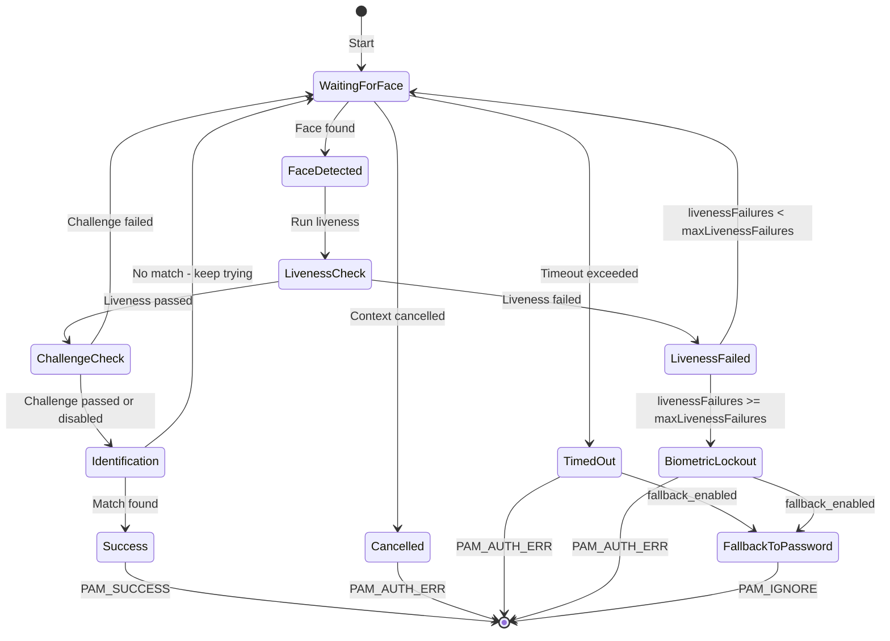

# Windows Hello-Like Authentication Flow for LinuxHello PAM

## Goal

Make the LinuxHello PAM authentication experience as close to Windows Hello as possible, focusing on:
- Seamless, non-blocking face detection loop
- Real-time user feedback during authentication
- Graceful fallback to password when face auth fails or times out
- Proper lockout behavior (per-session, not per-attempt within a session)
- Liveness failure handling that mirrors Windows Hello's anti-spoofing UX
- Support for both terminal (TTY) and graphical login manager (SDDM/GDM/LightDM) contexts

---

## Windows Hello Behavior Reference

| Behavior | Windows Hello | Current LinuxHello |
|---|---|---|
| Face detection loop | Continuous, no timeout | Continuous loop (implemented) |
| User feedback | "Looking for you..." / "Hi [Name]!" | Basic PAM text messages |
| No face found | Keeps waiting, shows "Looking for you..." | Keeps waiting (implemented) |
| Face found, no match | Keeps trying silently | Keeps trying (implemented) |
| Liveness failure | Shows "Make sure you are looking at the camera" and retries | Immediately fails auth (WRONG) |
| Multiple liveness failures | Locks out biometric, prompts PIN/password | Not implemented |
| Successful auth | "Hi [Name]!" then unlocks | Basic success message |
| Fallback | "Use PIN instead" button always visible | PAM_IGNORE if fallback_enabled |
| Lockout | After N liveness failures, biometric disabled for session | Not implemented |
| Cancellation | Click "Use PIN instead" | Ctrl+C / context cancellation |
| Graphical context | Native UI overlay | PAM text messages only |

---

## Key Gaps to Address

### 1. Liveness Failure Should NOT Be Immediately Terminal

**Current behavior:** A single liveness failure immediately returns `PAM_AUTH_ERR`.

**Windows Hello behavior:** Liveness failure shows a message like "Make sure you are looking at the camera" and retries. Only after N consecutive liveness failures does it lock out biometric auth for the session and prompt for PIN/password.

**Fix:** Add a `livenessFailureCount` counter in the auth loop. Only terminate on liveness failure after exceeding a configurable threshold (e.g., 3 consecutive failures).

### 2. Real-Time PAM Status Messages

**Current behavior:** Only two messages: "Authenticating..." and "Waiting for face detection... (Ctrl+C to cancel)".

**Windows Hello behavior:** Dynamic status updates:
- "Looking for you..." (no face detected)
- "Making sure it's you..." (face detected, running checks)
- "Hi [Name]!" (success)
- "Make sure you are looking at the camera" (liveness hint)
- "We didn't recognize you" (no match, retrying)

**Fix:** Add a `StatusCallback` mechanism or use PAM `PAM_TEXT_INFO` messages at each stage of the loop.

### 3. Graceful Fallback to Password

**Current behavior:** `fallback_enabled=true` returns `PAM_IGNORE` on any failure, which causes PAM to skip to the next module (usually password). But this only happens on hard failures, not on timeout or user-initiated cancel.

**Windows Hello behavior:** After a configurable number of failed face auth attempts (or on timeout), automatically fall through to password prompt with a clear message.

**Fix:** Add `MaxFaceAuthAttempts` config (default: 0 = unlimited). After N failed identification attempts (not liveness), return `PAM_IGNORE` to trigger password fallback.

### 4. Per-Session Lockout for Liveness Failures

**Current behavior:** The `RecordFailure()` / `CheckLockout()` system exists but is **not called** in the continuous auth loop in `AuthenticateUser()`. Liveness failures don't trigger lockout.

**Windows Hello behavior:** After 3 consecutive liveness failures (anti-spoofing), biometric auth is disabled for the current session and PIN/password is required.

**Fix:** 
- Call `RecordFailure()` on liveness failures
- Add a `MaxLivenessFailures` config (default: 3)
- After exceeding threshold, return `PAM_IGNORE` (fallback) or `PAM_AUTH_ERR`

### 5. Graphical Login Manager Support

**Current behavior:** Signal handler catches SIGINT/SIGTERM for Ctrl+C. But graphical login managers don't send signals - they abort via PAM conversation.

**Windows Hello behavior:** The "Use PIN instead" button is always available and immediately cancels face auth.

**Fix:** 
- Add a configurable `FaceDetectionTimeout` for graphical contexts (already exists in config but not well-documented)
- Document recommended values for SDDM/GDM/LightDM
- Consider adding a PAM conversation prompt that can be answered to cancel

---

## Proposed Architecture

### New Auth Loop State Machine



### New Config Fields

Add to [`AuthConfig`](internal/config/config.go:110) in `config.go`:

```go
type AuthConfig struct {
    // ... existing fields ...
    MaxLivenessFailures  int  `mapstructure:"max_liveness_failures"`   // Max consecutive liveness failures before lockout (default: 3)
    MaxFaceAuthAttempts  int  `mapstructure:"max_face_auth_attempts"`  // Max face match attempts before fallback (0 = unlimited)
    ShowStatusMessages   bool `mapstructure:"show_status_messages"`    // Show real-time status via PAM messages (default: true)
}
```

### New `AuthStatus` Type for Callbacks

Add to [`internal/auth/engine.go`](internal/auth/engine.go):

```go
// AuthStatus represents the current state of authentication for UI feedback
type AuthStatus int

const (
    StatusWaitingForFace  AuthStatus = iota // "Looking for you..."
    StatusFaceDetected                       // "Making sure it's you..."
    StatusLivenessHint                       // "Make sure you are looking at the camera"
    StatusNoMatch                            // "We didn't recognize you"
    StatusSuccess                            // "Hi [Name]!"
    StatusCancelled                          // Cancelled
    StatusFallback                           // Falling back to password
)

// StatusUpdate is sent to the caller during authentication
type StatusUpdate struct {
    Status   AuthStatus
    Username string // Set on success
    Message  string // Human-readable message
}
```

### Updated `AuthenticateUser()` Signature

```go
// AuthenticateUser authenticates a specific user with Windows Hello-like behavior
// statusChan receives real-time status updates (can be nil)
func (e *Engine) AuthenticateUser(
    ctx context.Context,
    username string,
    statusChan chan<- StatusUpdate,
) (*Result, error)
```

### Updated PAM `performAuthentication()`

```go
func performAuthentication(pamh *C.pam_handle_t, engine *auth.Engine, cfg *config.Config, username string) C.int {
    ctx := context.Background()
    ctx, signalCancel := setupSignalHandler(ctx)
    defer signalCancel()

    if cfg.Auth.FaceDetectionTimeout > 0 {
        var timeoutCancel context.CancelFunc
        ctx, timeoutCancel = context.WithTimeout(ctx, time.Duration(cfg.Auth.FaceDetectionTimeout)*time.Second)
        defer timeoutCancel()
    }

    // Create status channel for real-time feedback
    statusChan := make(chan auth.StatusUpdate, 10)
    
    // Start goroutine to relay status messages to PAM
    go func() {
        for update := range statusChan {
            if cfg.Auth.ShowStatusMessages {
                pamInfo(pamh, "LinuxHello: "+update.Message)
            }
        }
    }()

    result, err := engine.AuthenticateUser(ctx, username, statusChan)
    close(statusChan)

    // Handle result...
}
```

---

## Files to Modify

| File | Changes |
|---|---|
| [`internal/config/config.go`](internal/config/config.go) | Add `MaxLivenessFailures`, `MaxFaceAuthAttempts`, `ShowStatusMessages` to `AuthConfig`; update `DefaultConfig()` |
| [`internal/auth/engine.go`](internal/auth/engine.go) | Add `AuthStatus`, `StatusUpdate` types; update `AuthenticateUser()` to accept `statusChan`; add liveness failure counter; add face auth attempt counter; update `Authenticate()` and `AuthenticateWithDebug()` similarly |
| [`pkg/pam/pam_module.go`](pkg/pam/pam_module.go) | Update `performAuthentication()` to use status channel; improve PAM messages; handle new fallback conditions |

---

## Implementation Steps

### Step 1: Update Config

In [`internal/config/config.go`](internal/config/config.go:110):
- Add `MaxLivenessFailures int` (default: `3`)
- Add `MaxFaceAuthAttempts int` (default: `0` = unlimited)
- Add `ShowStatusMessages bool` (default: `true`)

### Step 2: Add Status Types to Engine

In [`internal/auth/engine.go`](internal/auth/engine.go):
- Add `AuthStatus` type and constants
- Add `StatusUpdate` struct
- Add helper `sendStatus(ch chan<- StatusUpdate, status AuthStatus, msg string, username string)`

### Step 3: Refactor `AuthenticateUser()` Loop

In [`internal/auth/engine.go`](internal/auth/engine.go:534):
- Add `livenessFailureCount` counter
- Add `faceAuthAttemptCount` counter
- Change liveness failure from terminal to retriable (up to `MaxLivenessFailures`)
- Send `StatusUpdate` at each stage
- Return `PAM_IGNORE`-triggering error after `MaxFaceAuthAttempts` exceeded
- Call `RecordFailure()` on liveness failures

### Step 4: Refactor `Authenticate()` Loop

In [`internal/auth/engine.go`](internal/auth/engine.go:228):
- Same liveness failure handling as `AuthenticateUser()`
- Add `statusChan` parameter

### Step 5: Update PAM Module

In [`pkg/pam/pam_module.go`](pkg/pam/pam_module.go:200):
- Add status channel goroutine
- Map `StatusUpdate` messages to PAM `pamInfo()` / `pamError()` calls
- Handle new `ErrBiometricLockout` error type for fallback

### Step 6: Update `AuthenticateWithDebug()`

In [`internal/auth/engine.go`](internal/auth/engine.go:658):
- Add `statusChan` parameter for consistency
- Same liveness failure handling

### Step 7: Update All Callers

- [`app.go`](app.go) - Wails GUI calls to `AuthenticateWithDebug()` and `Authenticate()`
- [`internal/cli/test.go`](internal/cli/test.go) - CLI test command
- [`internal/cli/enroll.go`](internal/cli/enroll.go) - Enrollment flow

---

## PAM Message Sequence (Windows Hello-Like)

```
LinuxHello: Looking for you...          <- WaitingForFace (every ~3 seconds)
LinuxHello: Making sure it's you...     <- FaceDetected
LinuxHello: Make sure you are looking   <- LivenessFailed (1st/2nd time)
            at the camera
LinuxHello: Making sure it's you...     <- FaceDetected (retry)
LinuxHello: Hi mrcode!                  <- Success
```

Or on failure:
```
LinuxHello: Looking for you...
LinuxHello: Making sure it's you...
LinuxHello: We didn't recognize you     <- NoMatch (shown briefly, then retry)
LinuxHello: Looking for you...
...
LinuxHello: Switching to password       <- After MaxFaceAuthAttempts or timeout
```

---

## Recommended Default Config Values

```yaml
auth:
  max_liveness_failures: 3      # Lock biometric after 3 consecutive liveness failures
  max_face_auth_attempts: 0     # 0 = unlimited (Windows Hello behavior)
  show_status_messages: true    # Show real-time feedback
  face_detection_timeout: 0     # 0 = no timeout for terminal; set 30 for graphical
  fallback_enabled: true        # Always allow password fallback
```

For graphical login managers (SDDM/GDM), recommend:
```yaml
auth:
  face_detection_timeout: 30    # 30 second timeout before falling back to password
  fallback_enabled: true
```

---

## New Error Types

Add to [`internal/auth/engine.go`](internal/auth/engine.go):

```go
// ErrBiometricLockout is returned when too many liveness failures occur
var ErrBiometricLockout = errors.New("biometric authentication locked out due to liveness failures")

// ErrMaxAttemptsExceeded is returned when face auth attempt limit is reached
var ErrMaxAttemptsExceeded = errors.New("maximum face authentication attempts exceeded")
```

---

## Backward Compatibility

- All new config fields have sensible defaults
- `statusChan` parameter can be `nil` (no-op)
- Existing behavior preserved when `MaxLivenessFailures=0` (disabled) and `MaxFaceAuthAttempts=0` (unlimited)
- `fallback_enabled=true` continues to work as before for all failure modes
